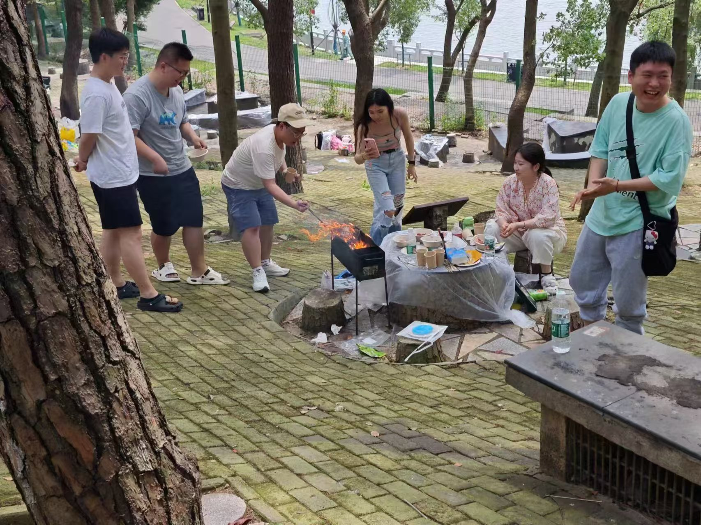
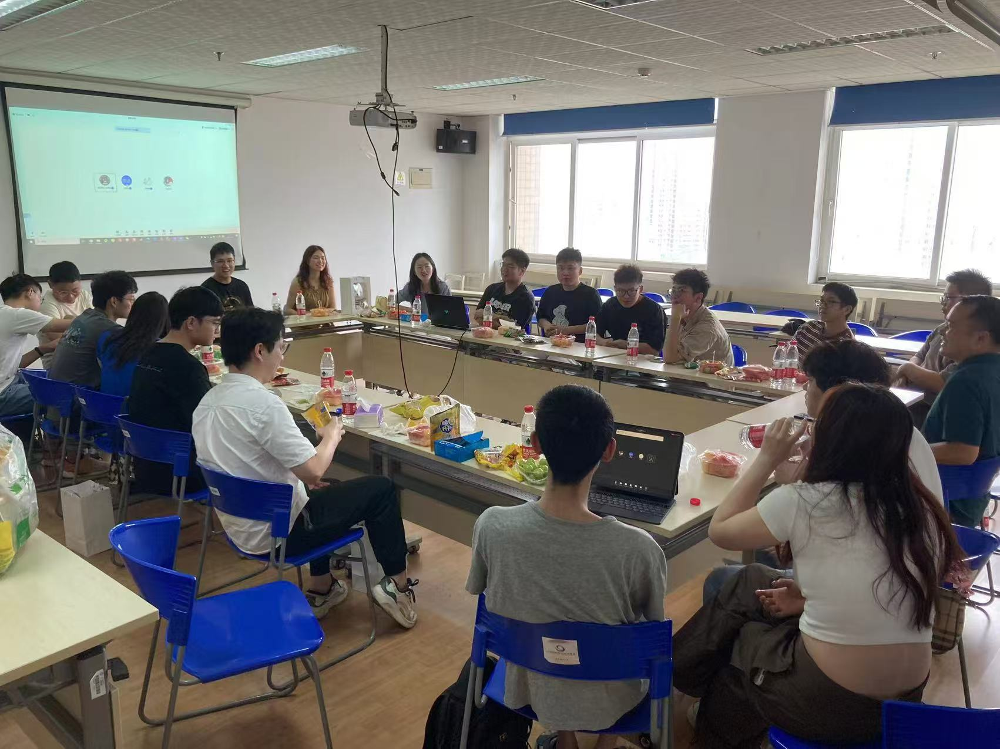
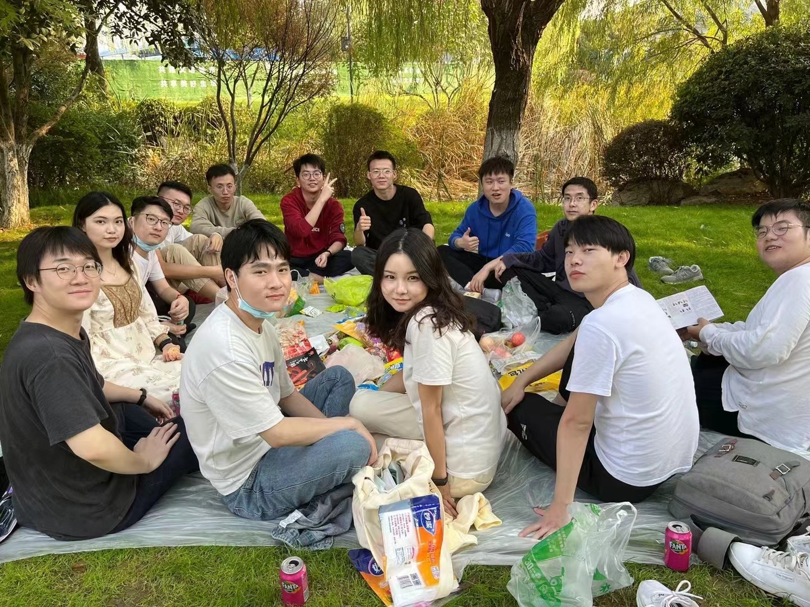
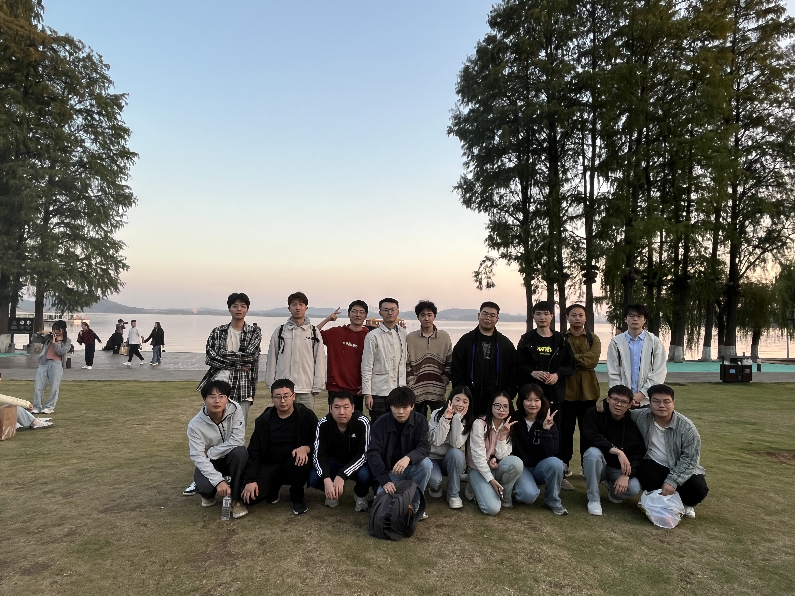
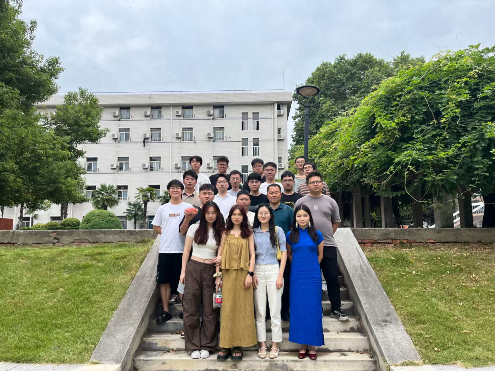

<!-- 顶部导航卡片，靠左对齐 -->

  <a href="#welcome" style="flex: 1; max-width: 250px; text-decoration: none;">
    

      
      <h4 style="margin: 15px 0; font-size: 1.2em; color: #333;">迎新活动</h4>
    

  </a>
  <a href="#bbq" style="flex: 1; max-width: 250px; text-decoration: none;">
    

      
      <h4 style="margin: 15px 0; font-size: 1.2em; color: #333;">东湖烧烤</h4>
    

  </a>
  <a href="#jobfair" style="flex: 1; max-width: 250px; text-decoration: none;">
    

      
      <h4 style="margin: 15px 0; font-size: 1.2em; color: #333;">求职分享会</h4>
    

  </a>

<!-- 添加平滑滚动效果 -->

# 🎉 实验室迎新活动：携手新程 {#welcome}

## 🌟 活动简介
欢迎新同学加入实验室大家庭！通过轻松愉快的聚餐交流，帮助新生快速融入团队。

{: style="width: 65%"}

&nbsp;  
#### *新生与师兄师姐围坐交流，共享美食*

# 🍖 实验室东湖烧烤野餐活动 {#bbq}

## 📅 活动简介
实验室每年会在举行春游和秋游团建活动，在东湖举行烧烤野餐活动。

### 集体合影

  

    
    
全体成员湖边合影

  

  

    
    

  

## 🔥 烧烤时刻
同学们分工合作准备食材和烧烤

{:style="width:65%"}

## 🌟 活动亮点
- 湖边烧烤，享受美食
- 团队游戏，增进感情
- 东湖散步，欣赏美景

活动在欢声笑语中圆满结束，大家期待下次再聚！

# 🚀 研三求职经验分享会：师兄师姐助力秋招冲刺 {#jobfair}

## 🌟 活动剪影

  

    
    
师兄师姐分享面试技巧

  

  

    
    

  

为帮助研三同学把握秋招黄金期，特邀已经毕业入职小米,中建三局等公司校友（覆盖互联网/国企/通信等行业）开展深度分享，助力师弟师妹拿到offer。
